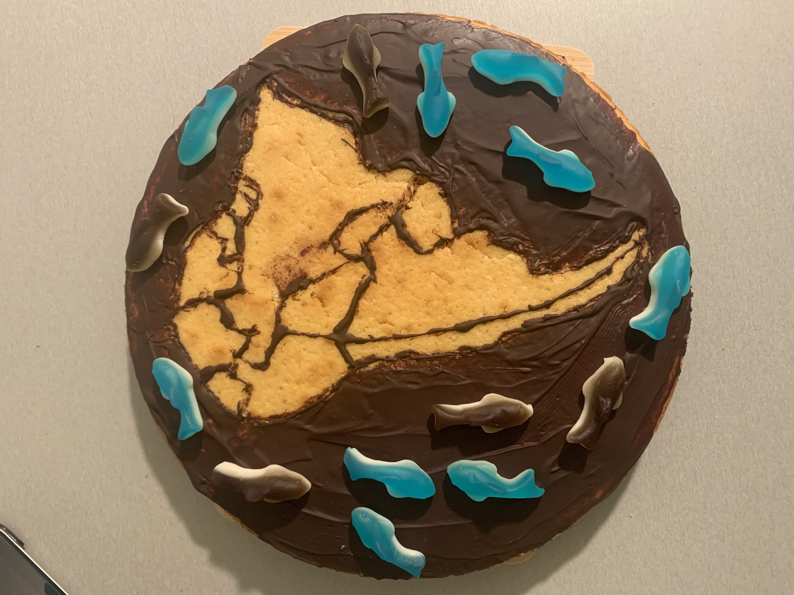

# 30DayMapChallenge21

[Link to the official repo](https://github.com/tjukanovt/30DayMapChallenge) of the challenge.

### Day 1 - Points

### Day 2 - Lines

### Day 3 - Polygons

### Day 4 - Hexagons

### Day 5 - OpenStreetMap

### Day 6 - Red

### Day 7 - Green

### Day 8 - Blue

### Day 9 - Monochrome

### Day 10 - Raster

### Day 12 - Population

### Day 13 - Natural Earth

### Day 15 - Map without using a computer

### Day 17 - Land

### Day 18 - Water

### Day 19 - Islands

### Day 21 - Elevation

### Day 22 - Boundaries

### Day 23 - Global Human Settlement Layer

### Day 25 - Interactive

(Link to interactive version)[https://rvdatainsights.shinyapps.io/PrecipitationDiffAfrica/]

### Day 26 - Choropleth

### Day 27 - Heatmap

### Day 29 - NULL

### Day 30 - Metamapping

